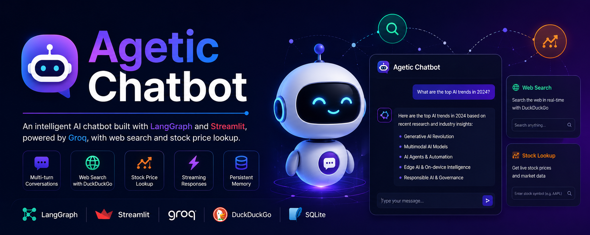
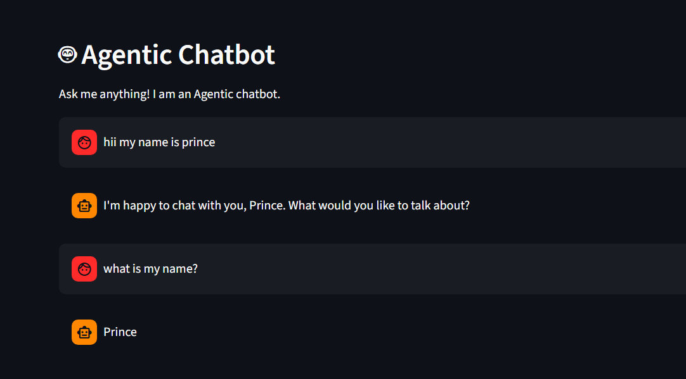

# 🤖 LangGraph Chatbot

<p align="center">
  
</p>

<p align="center">
  <b>An AI-powered chatbot built with LangGraph, Streamlit, and Groq featuring tool calling, conversation memory, and real-time streaming.</b>
</p>

<p align="center">


</p>

---

# ✨ Features

* 💬 Multi-turn conversations
* 🧠 Persistent conversation memory
* 🌐 Web Search support
* 📈 Live Stock Price Lookup
* ⚡ Streaming AI responses
* 🛠️ LangGraph tool calling
* 🗂️ Multiple chat threads
* 💾 SQLite persistence
* 🎨 Modern Streamlit UI

---

# 🖥️ Demo

<p align="center">

</p>

---

# 🏗️ Architecture

```
                User
                  │
                  ▼
          Streamlit Frontend
                  │
                  ▼
           LangGraph Agent
                  │
      ┌───────────┴───────────┐
      │                       │
      ▼                       ▼
 Web Search Tool      Stock Price Tool
      │                       │
      └───────────┬───────────┘
                  │
                  ▼
              Groq LLM
                  │
                  ▼
          Streaming Response
                  │
                  ▼
            SQLite Memory
```

---

# 📂 Project Structure

```
langgraph-chatbot/

├── app/
│
├── backend/
│   ├── agent.py
│   ├── tools.py
│   └── __init__.py
│
├── frontend/
│   ├── app.py
│   └── __init__.py
│
├── config/
│   └── settings.py
│
├── data/
│   └── chatbot.db
│
├── requirements.txt
├── .env.example
├── README.md
└── .gitignore
```

---

# 🚀 Getting Started

## 1. Clone Repository

```bash
git clone https://github.com/yourusername/langgraph-chatbot.git

cd langgraph-chatbot
```

---

## 2. Install Dependencies

```bash
pip install -r requirements.txt
```

---

## 3. Configure Environment

Create a `.env` file:

```env
GROQ_API_KEY=your_api_key

GROQ_MODEL=llama-3.1-8b-instant

DATABASE_PATH=data/chatbot.db
```

---

## 4. Run

```bash
streamlit run app/frontend/app.py
```

Application:

```
http://localhost:8501
```

---

# 🔧 Available Tools

## 🌐 Web Search

Example:

```
Search latest AI news
```

Uses DuckDuckGo for real-time information.

---

## 📈 Stock Price Lookup

Example:

```
What is the current price of AAPL?
```

Fetches live stock prices.

---

# 🗄️ Conversation Flow

```
User Message
      │
      ▼
LangGraph Agent
      │
      ▼
Need Tool?
  │        │
 No       Yes
  │         │
  │     Execute Tool
  │         │
  └────► Groq LLM
            │
            ▼
     Stream Response
            │
            ▼
      Store in SQLite
```

---

# ☁️ Deploy on Streamlit Cloud

## Push Code

```bash
git init

git add .

git commit -m "Initial Commit"

git remote add origin https://github.com/yourusername/langgraph-chatbot.git

git push -u origin main
```

## Deploy

* Create a Streamlit Cloud account
* Connect your GitHub repository
* Select:

```
Branch:
main

Main file:
app/frontend/app.py
```

Add Secrets:

```text
GROQ_API_KEY="your_key"

GROQ_MODEL="llama-3.1-8b-instant"

DATABASE_PATH="data/chatbot.db"
```

Click **Deploy** 🎉

---

# ⚙️ Environment Variables

| Variable        | Description     |
| --------------- | --------------- |
| GROQ_API_KEY    | Groq API Key    |
| GROQ_MODEL      | Model Name      |
| DATABASE_PATH   | SQLite Database |
| STREAMLIT_THEME | UI Theme        |

---

# 🐞 Troubleshooting

### Database Missing

```
No such file: chatbot.db
```

✅ The database is automatically created on first run.

---

### API Key Missing

```
GROQ_API_KEY not found
```

✅ Add the key to your `.env` or Streamlit Secrets.

---

### Tools Not Working

* Verify internet connectivity
* Verify API credentials
* Restart the application

---

# 📚 Tech Stack

* Python
* LangGraph
* LangChain
* Streamlit
* Groq
* DuckDuckGo Search
* SQLite

---

# ⭐ Support

If you found this project useful, consider giving it a **⭐ Star** on GitHub.

It helps others discover the project and motivates further development.

---

# 📄 License

MIT License

---

# 👨‍💻 Author

Built with ❤️ using **LangGraph**, **Streamlit**, and **Groq**.
